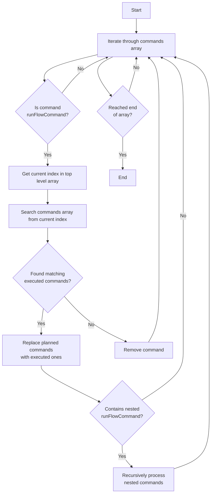

# Flow Command Data Structure

## Overview
This document explains the structure of flow command data in the Maestro debug output, specifically focusing on the distinction between planned commands and executed commands.

## Data Structure

### Top Level Structure
The debug output is an array of command executions, where each execution contains:
1. A `command` object that describes what was attempted
2. A `metadata` object that contains execution details like status, timestamp, and duration

### Command Types
Commands can be of different types, including:
- Direct commands (like `tapOnElement`, `setAirplaneModeCommand`)
- Flow commands (`runFlowCommand`) that contain nested commands to be executed conditionally

### runFlowCommand Structure
The `runFlowCommand` is a special command type that contains:
1. A `commands` array - List of commands to be executed in that flow
2. Optional `condition` - Determines if the flow should execute
3. Optional `config` - Configuration for the flow
4. Optional `sourceDescription` - Reference to the source file

### Example Structure
```json
[
  {
    "command": {
      "tapOnElement": {
        "selector": {
          "textRegex": "Listen",
          "optional": false
        },
        "retryIfNoChange": true,
        "waitUntilVisible": false,
        "longPress": false,
        "optional": false
      }
    },
    "metadata": {
      "status": "COMPLETED",
      "timestamp": 1740609410687,
      "duration": 4997
    }
  },
  {
    "command": {
      "runFlowCommand": {
        "commands": [
          // Nested commands to be executed
        ],
        "condition": {
          "scriptCondition": "${CLEAR_STATE != 'true'}"
        },
        "optional": false
      }
    },
    "metadata": {
      "status": "COMPLETED",
      "timestamp": 1740609392556,
      "duration": 5594
    }
  }
]
```

## Important Notes
- Each command execution includes both the command definition and its execution metadata
- The `metadata` object contains important debugging information:
  - `status`: Can be "COMPLETED", "FAILED", or "SKIPPED"
  - `timestamp`: When the command was executed
  - `duration`: How long the command took to execute (in milliseconds)
  - `error`: Present if the command failed, containing detailed error information
- `runFlowCommand` allows for conditional execution of command sequences
- Commands within a flow may be skipped based on their conditions 

## Data Transformation for Nested Flows
For proper handling of nested flows, the data structure needs to be transformed. Instead of having `runFlowCommand` contain planned commands, it should contain the actual commands that were executed. Here's how the transformation should work:

### Current Structure (Not Preferred)
```json
{
  "command": {
    "runFlowCommand": {
      "commands": [
        // Planned commands that may or may not have executed
      ]
    }
  },
  "metadata": {
    "status": "COMPLETED"
  }
}
```

### Preferred Structure
```json
{
  "command": {
    "runFlowCommand": {
      "commands": [
        // Array of commands that actually executed, with their metadata
        {
          "command": {
            "tapOnElement": { /* ... */ }
          },
          "metadata": {
            "status": "COMPLETED",
            "timestamp": 123456789,
            "duration": 1000
          }
        }
      ]
    }
  },
  "metadata": {
    "status": "COMPLETED"
  }
}
```

### Why This Matters
- The preferred structure provides a clear execution history
- Makes it easier to debug flow execution by showing what actually ran
- Ensures proper tracking of nested command execution status
- Helps maintain accurate timing and duration information for nested commands
- Enables better error tracking in complex nested flows 

## Data Transformation Algorithm

### Process Overview
The transformation process recursively processes nested flow commands to replace planned commands with actual execution data.



### Key Points
1. Process starts at the top level commands array
2. For each `runFlowCommand`, search the top-level array starting from current index
3. Replace planned commands with actual executed commands if found
4. Remove commands that weren't executed
5. Recursively process any nested `runFlowCommand` instances
6. Maintain original metadata and execution information

### Search Strategy
- Start search from the current command's index in top-level array
- Match flows based on command structure and context
- Preserve execution metadata from actual runs
- Handle cases where planned commands weren't executed 